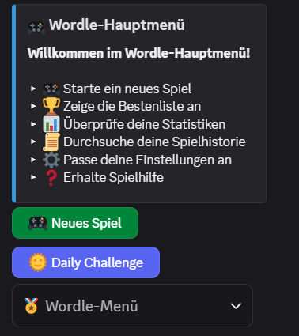

# 🎮 Discord Wordle Bot

Ein vollständig anpassbarer Wordle-Bot für Discord-Server mit vielen Funktion, überzeuge dich gerne.



## 🌟 Hauptfunktionen
- **🌞 Tägliche Challenges** mit globaler Bestenliste
- **📊 Detaillierte Statistiken** pro Spieler/Server
- **🎭 Anonymer Spielmodus** mit Passwortschutz
- **⚙️ Web-Dashboard** für Serverkonfiguration
- **🔧 Eigenes Wortlisten** einfach anpassbar

## 🚀 Installation
### Voraussetzungen
- Python 3.10+
- Discord Server mit Admin-Rechten
- [Bot-Token](https://discord.com/developers/applications)
- Disord Intents aktivieren
- Discord Bot auf Discord Server einladen

### Schritt-für-Schritt
```
# 1. Repository klonen
git clone https://github.com/pilzithegoat/discord-bot-wordle.git
cd discord-bot-wordle

# 2. Virtuelle Umgebung erstellen
python -m venv .venv
source .venv/bin/activate  # Linux/Mac
.venv\Scripts\activate     # Windows

# 3. Abhängigkeiten installieren
pip install -r requirements.txt

# 4. Konfigurationsdatei erstellen
cp .env.example .env
nano .env  # Bearbeite mit deinen Daten
```
### Discord Dev Portal
1. Application erstellen
2. Bot -> Links im Menü auf Bot klicken
3. Intents -> Presence Intent = On, Server Members Intent = On, Message Content Intent = On
4. Bot auf Server einladen -> https://discord.com/oauth2/authorize?client_id=deine_client_id&permissions=8798240730112&integration_type=0&scope=bot+applications.commands
5. Client ID herausfinden -> OAuth2 -> Client ID kopiern und einfügen bei client_id=
6. Alternativ eigene URL generieren lassen. WICHTIG!! Unbedingt bot und applications.commands auswählen.
7. Auf den Link klicken und Bot auf gewünschten Server einladen.
8. Token kopieren und in die .env unter ``TOKEN=""`` einfügen. Es muss darauf geachtet werden, dass der Token sich in anführungszeichen Bedfinden wie in diesem Beispiel -> ``"dein_token_hier"``

### 📋 .env-Beispieldatei
```
TOKEN=dein_bot_token_hier
MAX_HINTS=3 #-> wie viele Tipps soll es pro spiel geben
MAX_ATTEMPTS=6 #-> wie viele Versuche an Wörtern gibt es pro Spiel
WORDS_FILE="words.txt" #-> Speicherort von der Wörterliste mit allen Wörtern
DATA_FILE="wordle_data.json" #-> Speicherort wo die einzelnen Spiele gespeichert werden
CONFIG_FILE="server_config.json" #-> Speicherort wo die einzelnen Server configs gespeichert werden
SETTINGS_FILE="user_settings.json" #-> Speicherort wo die einzelen User settings gespeichert werden
DAILY_FILE="daily_data.json" #-> Speicherort wo die täglichen Spiele gespeichert werden
```
Vordefinierte [.env](./.env) | Einfach auf den .env klicken du wirst automatisch zu einer vordefinierten .env weitergeleitet.

### Wordle auf Server einrichten
Einfach in einen Channel gehen und `/wordle_setup` eigeben(Server Admin berechtigung muss vorhanden sein!)

## 🕹️ Verwendung
### Grundlegende Befehle
| Befehl          | Beschreibung                  |
|-----------------|-------------------------------|
| `/wordle`       | Startet neues Spiel           |
| `/achievements` | Zeige deine Achievements      |
| `/daily`        | Tägliche Challenge            |
| `/historie`     | Zeige deine Spielverläufe an  |
| `/search`       | Suche nach Benutzerstatistiken|
| `/settings`     | Privatsphäre-Einstellungen    |
| `/wordle_setup` | Richte den Wordle-Channel ein nur im Ausgewählten Channel senden, In diesem Channel wird das Embed erstellt.|

### Bilder
Bilder sind nochmal ganz unten der Readme hinterlegt. :D


## 🔧 Anpassungen
### Eigene Wörter hinzufügen
1. Öffne die Wortdateien:
   ```
   nano data/words_de.txt  # Deutsche Wörter
   ```
2. Füge Wörter hinzu (pro Zeile ein 5-Buchstaben-Wort):
   ```
   KLIMA
   WOCHE
   ZEBRA
   ```

## 🛠️ Entwicklung
### Beitragsrichtlinien
1. Fork das Repository
2. Erstelle Feature-Branch:
   ```
   git checkout -b feature/meine-neue-funktion
   ```
3. Committe Änderungen:
   ```
   git commit -m "füge awesome feature hinzu"
   ```
4. Push zum Branch:
   ```
   git push origin feature/meine-neue-funktion
   ```
5. Öffne Pull Request


## 📜 Lizenz
MIT License - Siehe [LICENSE](LICENSE) für Details

---

> **Hinweis:** Dieser Bot steht in keiner Verbindung zum offiziellen Wordle-Spiel.  
> Probleme? [Issue erstellen](https://github.com/pilzithegoat/discord-bot-wordle/issues)
---
>> **!!Extra Hinweis!!** Dieser Bot ist ein Experiment von mir um zugucken was man alles 
>> mit KI machen kann, deswegen ist dieser Bot zu 100% mit der KI [DeepSeek](https://www.deepseek.com/en) erstellt worden.
>> Dies ist der Grund weshalb ihr mit diesem Bot/Code alles machen könnt was ihr wollt.
>>
>> ✌️𝓟𝓲𝓵𝔃𝓲

## 🖼️Bilder
### Hauptmenü


### Spiel
   

### Historie
