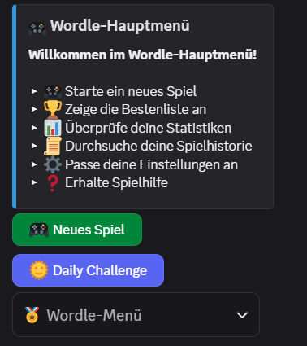
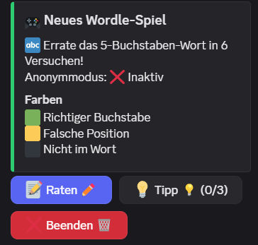
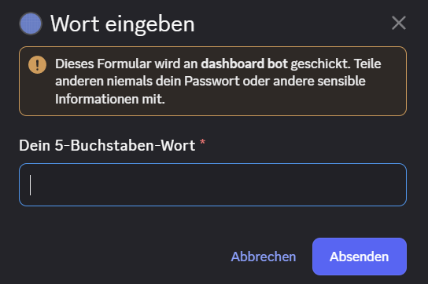
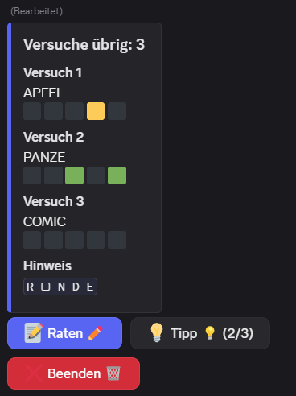
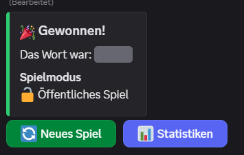
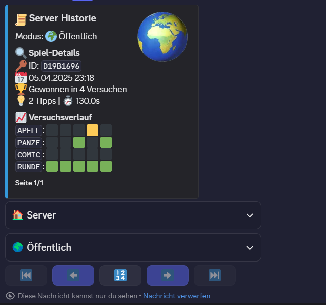

# 🎮 Discord Wordle Bot
### DE🇩🇪

Ein vollständig anpassbarer Wordle-Bot für Discord-Server mit vielen Funktion, überzeuge dich doch gerbe selber!

## 🌟 Hauptfunktionen
- **🌞 Tägliche Challenges** mit globaler Bestenliste
- **📊 Detaillierte Statistiken** pro Spieler/Server
- **🎭 Anonymer Spielmodus** mit Passwortschutz
- **🔧 Eigene Wortlisten** einfach anpassbar

## 🚀 Installation
### Voraussetzungen
- Python 3.10+
- Discord Server mit Admin-Rechten
- [Bot-Token](https://discord.com/developers/applications)
- Disord Intents aktivieren
- Discord Bot auf Discord Server einladen

### Schritt-für-Schritt
```
# 1. Repository klonen
git clone https://github.com/pilzithegoat/discord-bot-wordle.git
cd discord-bot-wordle

# 2. Virtuelle Umgebung erstellen
python -m venv .venv
source .venv/bin/activate  # Linux/Mac
.venv\Scripts\activate     # Windows

# 3. Abhängigkeiten installieren
pip install -r requirements.txt

# 4. Konfigurationsdatei erstellen
cp .env.example .env
nano .env  # Bearbeite mit deinen Daten
```
### Discord Dev Portal
1. Application erstellen
2. Bot -> Links im Menü auf Bot klicken
3. Intents -> Presence Intent = On, Server Members Intent = On, Message Content Intent = On
4. Bot auf Server einladen -> https://discord.com/oauth2/authorize?client_id=deine_client_id&permissions=8798240730112&integration_type=0&scope=bot+applications.commands
5. Client ID herausfinden -> OAuth2 -> Client ID kopiern und einfügen bei client_id=
6. Alternativ eigene URL generieren lassen. WICHTIG!! Unbedingt bot und applications.commands auswählen.
7. Auf den Link klicken und Bot auf gewünschten Server einladen.
8. Token kopieren und in die .env unter ``TOKEN=""`` einfügen. Es muss darauf geachtet werden, dass der Token sich in anführungszeichen Bedfinden wie in diesem Beispiel -> ``"dein_token_hier"``

### 📋 .env-Beispieldatei
```
TOKEN=dein_bot_token_hier
MAX_HINTS=3 #-> wie viele Tipps soll es pro spiel geben
MAX_ATTEMPTS=6 #-> wie viele Versuche an Wörtern gibt es pro Spiel
WORDS_FILE="words.txt" #-> Speicherort von der Wörterliste mit allen Wörtern
DATA_FILE="wordle_data.json" #-> Speicherort wo die einzelnen Spiele gespeichert werden
CONFIG_FILE="server_config.json" #-> Speicherort wo die einzelnen Server configs gespeichert werden
SETTINGS_FILE="user_settings.json" #-> Speicherort wo die einzelen User settings gespeichert werden
DAILY_FILE="daily_data.json" #-> Speicherort wo die täglichen Spiele gespeichert werden
```
Vordefinierte [.env](./.env) | Einfach auf den .env klicken du wirst automatisch zu einer vordefinierten .env weitergeleitet.

### Wordle auf Server einrichten
Einfach in einen Channel gehen und `/wordle_setup` eigeben(Server Admin berechtigung muss vorhanden sein!)

## 🕹️ Verwendung
### Grundlegende Befehle
| Befehl          | Beschreibung                  |
|-----------------|-------------------------------|
| `/wordle`       | Startet neues Spiel           |
| `/achievements` | Zeige deine Achievements      |
| `/daily`        | Tägliche Challenge            |
| `/historie`     | Zeige deine Spielverläufe an  |
| `/search`       | Suche nach Benutzerstatistiken|
| `/settings`     | Privatsphäre-Einstellungen    |
| `/wordle_setup` | Richte den Wordle-Channel ein nur im Ausgewählten Channel senden, In diesem Channel wird das Embed erstellt.|

### Bilder
Bilder sind nochmal ganz unten der Readme hinterlegt. :D


## 🔧 Anpassungen
### Eigene Wörter hinzufügen
1. Öffne die Wortdateien:
   ```
   nano data/words_de.txt  # Deutsche Wörter
   ```
2. Füge Wörter hinzu (pro Zeile ein 5-Buchstaben-Wort):
   ```
   KLIMA
   WOCHE
   ZEBRA
   ```

## 🛠️ Entwicklung
### Beitragsrichtlinien
1. Fork das Repository
2. Erstelle Feature-Branch:
   ```
   git checkout -b feature/meine-neue-funktion
   ```
3. Committe Änderungen:
   ```
   git commit -m "füge awesome feature hinzu"
   ```
4. Push zum Branch:
   ```
   git push origin feature/meine-neue-funktion
   ```
5. Öffne Pull Request

## ❓Support
Für dieses Repo gibt es keinen Support. Probiert probleme selber zulösen. Ihr könnt totzdem ein Issue erstellen aber keine Garantie auf erfolgreiche hilfe.

## 📜 Lizenz
MIT License - Siehe [LICENSE](LICENSE) für Details

---

> **Hinweis:** Dieser Bot steht in keiner Verbindung zum offiziellen Wordle-Spiel.  
> Probleme? [Issue erstellen](https://github.com/pilzithegoat/discord-bot-wordle/issues)
---
>> **!!Extra Hinweis!!** Dieser Bot ist ein Experiment von mir um zugucken was man alles 
>> mit KI machen kann, deswegen ist dieser Bot zu 100% mit der KI [DeepSeek](https://www.deepseek.com/en) erstellt worden.

### EN🇬🇧
A fully customizable Wordle bot for Discord servers with lots of features — feel free to check it out yourself!

## 🌟 Main Features
- **🌞 Daily challenges** with global leaderboard
- **📊 Detailed statistics** per player/server
- **🎭 Anonymous mode** with password protection
- **🔧 Custom word lists** easily adjustable

## 🚀 Installation
### Requirements
- Python 3.10+
- Discord server with admin rights
- [Bot token](https://discord.com/developers/applications)
- Activate Discord Intents
- Invite Discord bot to Discord server

### Step-by-step
```
# 1. Clone repository
git clone https://github.com/pilzithegoat/discord-bot-wordle.git
cd discord-bot-wordle

# 2. Create virtual environment
python -m venv .venv
source .venv/bin/activate  # Linux/Mac
.venv\Scripts\activate     # Windows

# 3. Install dependencies
pip install -r requirements.txt

#4. Create configuration file
cp .env.example .env
nano .env  # Edit it with your data
```

### Discord Dev Portal
1. Create application
2. Bot -> Click on Bot in the menu
3. Intents -> Presence Intent = On, Server Members Intent = On, Message Content Intent = On
4. Invite bot to server -> https://discord.com/oauth2/authorize?client_id=your_client_id&permissions=8798240730112&integration_type=0&scope=bot+applications.commands
5. Find client ID -> OAuth2 -> Copy Client ID and paste it for client_id=
6. Alternatively let it generate its own URL. IMPORTANT!! Make sure to select both bot and applications.commands.
7. Click the link and invite the bot to the desired server.
8. Copy the token and put it into .env under ``TOKEN=""``. Take care that the token is within quotation marks, e.g. ``"your_token_here"``

### 📋 .env Example File
```
TOKEN=your_bot_token_here
MAX_HINTS=3 #-> how many hints per game
MAX_ATTEMPTS=6 #-> how many attempts per game
WORDS_FILE=“words.txt” #-> file with all words
DATA_FILE=“wordle_data.json” #-> where individual games are stored
CONFIG_FILE=“server_config.json” #-> where server configs are stored
SETTINGS_FILE=“user_settings.json” #-> where user settings are stored
DAILY_FILE=“daily_data.json” #-> where daily games are stored
```

Predefined [.env](./.env) | Simply click the .env file and you’ll be redirected to the predefined .env.

### Set up Wordle on your server
Just go into a channel and type `/wordle_setup` (Server admin permission required!)

## 🕹️ Usage
### Basic Commands
| Command         | Description                      |
|-----------------|----------------------------------|
| `/wordle`       | Starts a new game                |
| `/achievements` | Show your achievements           |
| `/daily`        | Daily challenge                  |
| `/historie`     | Show your game history           |
| `/search`       | Search for user statistics       |
| `/settings`     | Privacy settings                 |
| `/wordle_setup` | Set up the Wordle channel only send in the chosen channel, the embed will be created in this channel.|

### Images
Images are shown again at the very bottom of the README :D

## 🔧 Customization
### Add your own words
1. Open the word files:
 ```
nano data/words.txt  # German words
 ```
2. Add words (one 5-letter word per line):
  ```
   KLIMA
   WOCHE
   ZEBRA
   ```

## 🛠️ Development
### Contribution Guidelines
1. Fork the repository
2. Create a feature branch:
 ```
   git checkout -b feature/my-new-feature
   ```
3. Commit your changes:
```
git commit -m “add awesome feature”
```
4. Push the branch:
```
git push origin feature/my-new-feature
```
5. Open a Pull Request

## ❓ Support
There is no support for this repo. Try to solve problems yourself. You can still open an issue, but there is no guarantee for help.

## 📜 License
MIT License - See [LICENSE](LICENSE) for details

***

> **Note:** This bot is not connected to the official Wordle game.  
> Problems? [Create an issue](https://github.com/pilzithegoat/discord-bot-wordle/issues)

***
>> **!!Extra Note!!** This bot is an experiment of mine to see what's possible with AI, so  
>> the bot is 100% created with the AI [DeepSeek](https://www.deepseek.com/en).

***


## 🖼️Picture
### Mainmenu


### Game
   

### History

